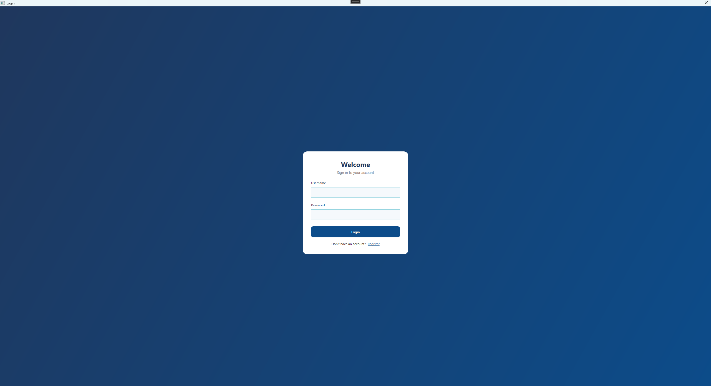
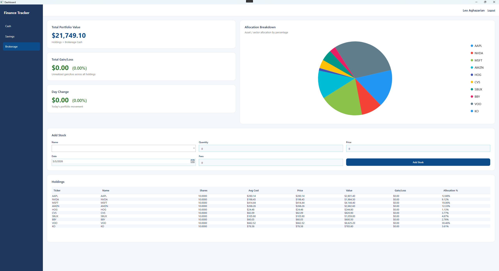

# Personal Finance Tracker
This is a desktop personal finance tracking application that lets users register/login and manage different parts of their finances from a dashboard-style interface.

## Overview
It tracks three main areas:
+ Cash: Shows the user’s cash balance, lets them add cash and transactions, tracks monthly spending, compares spending against a monthly budget, and displays cash flow/net cash change charts.
+ Savings: Shows total savings balance, current APY, lets the user deposit money and edit APY, and displays a savings balance chart over time.
+ Brokerage: Shows portfolio value, total gain/loss, day change, allocation breakdown, and a holdings table. Users can search for stocks using Alpha Vantage, add holdings, auto-fill stock price data, and refresh current prices so portfolio value and gain/loss update.

## Design
The program uses a WPF MVVM architecture with a layered backend design. At a high level, its organized like this:
<br>`View -> ViewModel -> Service -> Repository -> Firestore / External APIs`</br>

+ **Views** are the XAML files such as CashView.xaml, SavingsView.xaml, BrokerageView.xaml, LoginView.xaml, and MainView.xaml. They define the UI layout, cards, charts, tables, buttons, and input fields.
+ **ViewModels** hold the UI state and command logic. For example, CashViewModel exposes CashBalance, MonthlyBudgetLimit, CurrentMonthTransactions, and commands like AddCashCommand. The UI binds to these properties and commands instead of directly handling business logic in XAML code-behind.
+ **Services** contain the application/business logic. For example, CashService handles adding transactions and calculating spending, SavingsService handles deposits and APY updates, and BrokerageService handles portfolio calculations, holdings, and price refreshing.
+ **Repositories** contain the application/business logic. For example, CashService handles adding transactions and calculating spending, SavingsService handles deposits and APY updates, and BrokerageService handles portfolio calculations, holdings, and price refreshing.
+ **Repositories** isolate Firestore database access. Files like CashRepository, SavingsRepository, and BrokerageRepository are responsible for reading and writing user data under Firestore paths like below to keep database code out of the ViewModels:
```
users/{username}/cashAccounts
users/{username}/savingsAccounts
users/{username}/brokerageAccounts
```
+ **Models** represent the stored data, such as User, Cash, CashTransaction, Savings, Brokerage, Holding, and BrokerageTransaction. These models are Firestore-compatible using attributes like [FirestoreData] and [FirestoreProperty].

The app also uses dependency wiring in App.xaml.cs, where Firestore, repositories, services, and ViewModels are created and connected. Alpha Vantage is used as an external service for stock symbol search and price data, while LiveCharts2 is used for visual charts.

Overall, the design separates UI, state management, business rules, persistence, and external API access so each part of the program has a clear responsibility.

## Tech Stack
+ WPF (Windows Presentation Foundation) - UI framework
+ AlphaVantage API - real time stock data retrieval
+ Firebase Firestore - cloud database
+ LiveCharts2 - dynamic line and pie charts

## Screenshots

<p align="center">
  
  
</p>